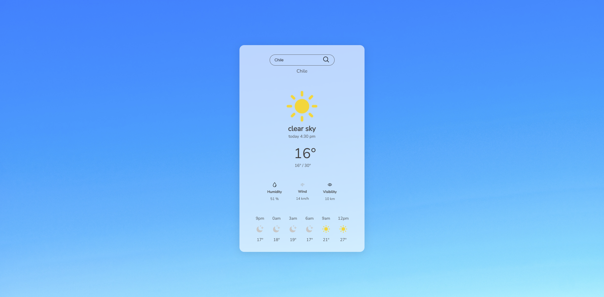
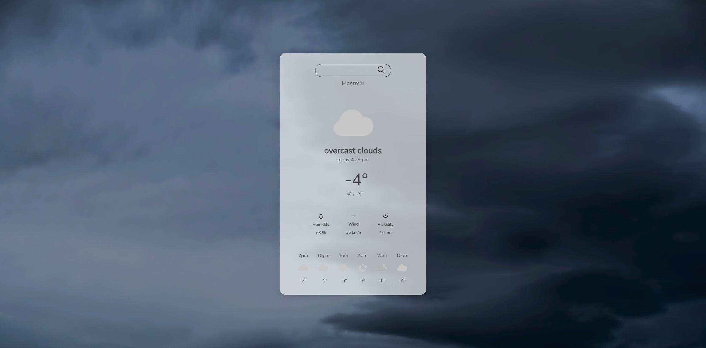
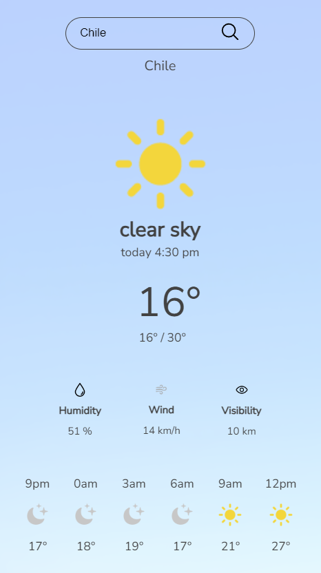

# Weather Application

Weather Application is a modern weather app built using Vite, React.js, javaScript and the OpenWeatherMap API. It provides real-time weather updates for your current location and any location you choose.

## Live Demo

Explore a live version of the app [here](https://hectorbernstorff.github.io/weather-app/).

## Screenshots







## Getting Started

To set up the Weather Application on your local machine for development and testing, follow these steps.

### Installation

1. Clone the repository:

    ```bash
    git clone https://github.com/HectorBernstorff/weather-app.git
    ```

2. Install dependencies:

    ```bash
    npm install
    ```

3. Start the development server:

    ```bash
    npm run dev
    ```

## Tech Stack

- Vite: A modern web development build tool.
- React.js: A JavaScript library for building user interfaces.
- JavaScript: The primary programming language used for the project's functionality.
- OpenWeatherMap API: An API for weather data.

## Development

To deploy the app, build the production version using the following command:

```bash
npm run build
